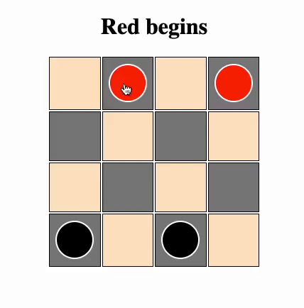

# Checkers

By: Ben Kaplan

---

[GitHub](https://github.com/JBenKaplan) | [Trello](https://trello.com/b/N2WlwgC4/checkers) | [LinkedIn](https://www.linkedin.com/in/jbenkaplan/)

 

## **_Description_**

---

A web-based game of checkers. Made to be played with 2 human players.

 

## **_Technologies Used_**

---

- Coding
  - HTML
  - CSS
  - JS
- Deployment
  - Surge

 

# Get Started

Two players take turns moving their pieces diagonally a square at a time. Jumping over the other players' piece results in a point for the jumper, and a lost piece for the jumpee. A winner is declared when they have sucessfully captured all the other players pieces.

 

### **_Credits_**

---

- [Hasbro Official Rules](https://www.hasbro.com/common/instruct/Checkers.PDF)

 

### **_Future Updates_**

---

- []
- []
- []
- []
